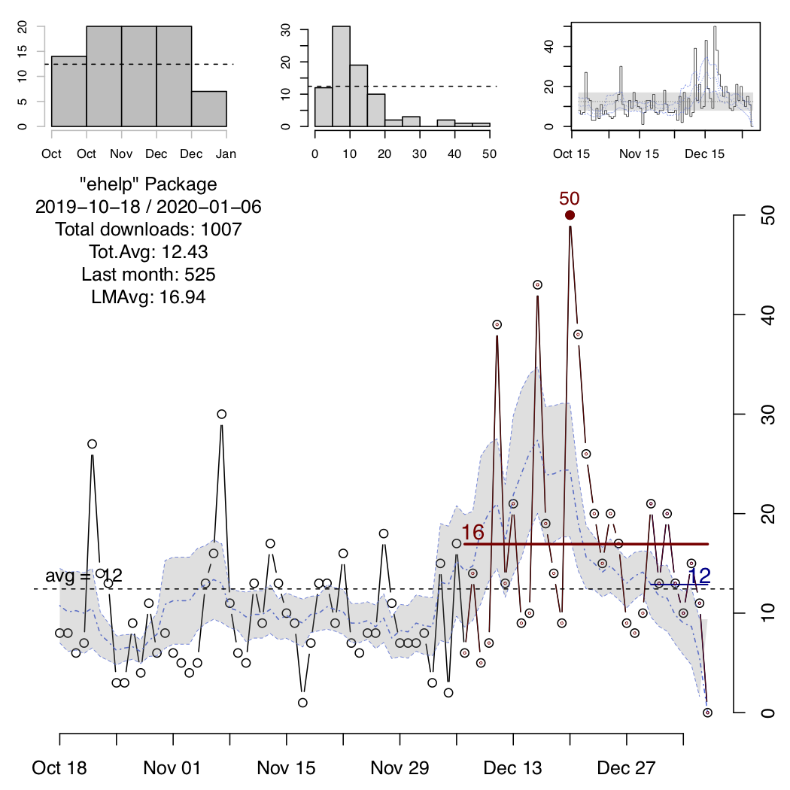
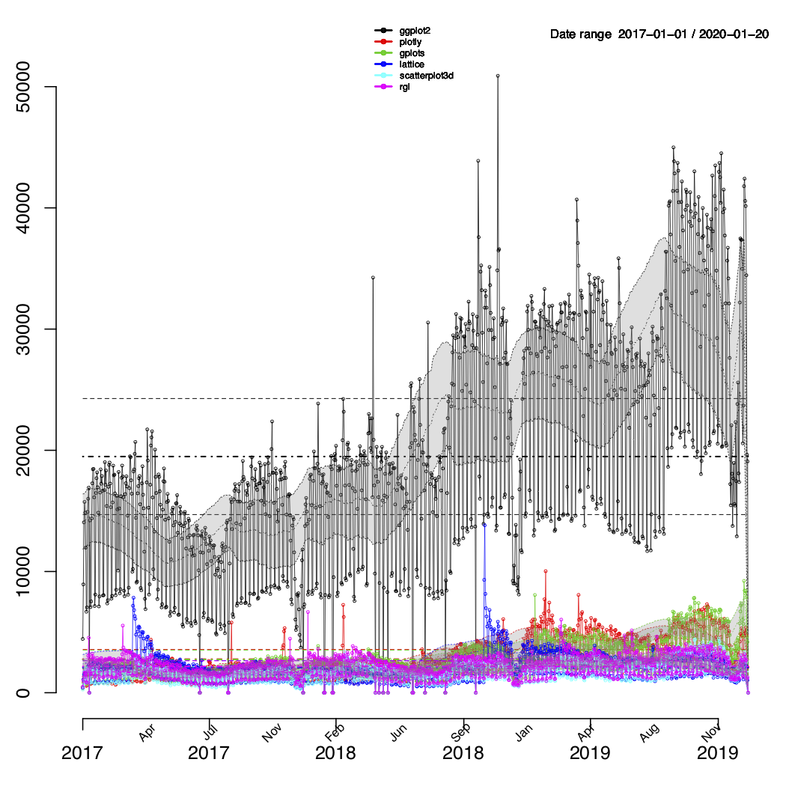
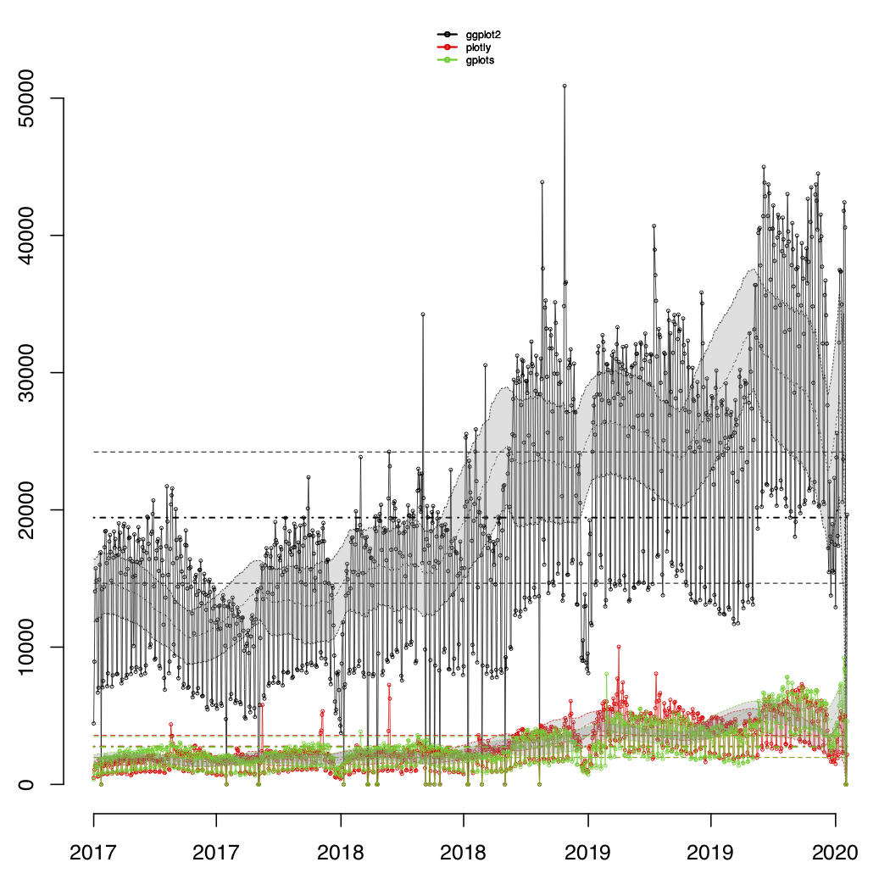

# Visualize.CRAN.Downloads


## Introduction
This package allows you to visualize the number of downloads for an specific
package in the CRAN repository.

The user can specify different ways to display the information: in a classic
(static) plot, an interactive representation, and/or a combined figure
comparing multiple packages.


## Features
### Automatic date specification and selection
The user can specify the range of dates to be processed, however the main
function of the package will run a couple of checks and adjustments on these:

1) if no dates are specified it will assume the current date as the end of the
period and a year before as the starting date, ie. a period of a year since today;

2) given a range of dates, it will reset the range to the first reported download
within the specified dates, so that dates previous to any reported download from
the CRAN logs are not shown, in this way the package can generate a cleaner and
more meaningful visualization.

### Displaying "moving" statistical estimators
In other to show a closer trend to the time series data of downloads, the package will also displaying moving averages and moving intervals of confidence. The confidence interval is also shaded in the main plot.
Both features can be turned off, using the corresponding flags in the optios: `"noMovingAvgs"` and `"noConfBands"`.


## Implementation
Visualize.CRAN.Downloads utilizes the `cranlogs` package for accessing the data of
the downloads and the `plotly` package for generating interactive visualizations.
The basic (static) plots are generated employing R basic capabilities.
The basic plots are saved in the current directory in a PDF file named
*"DWNLDS_**packageName**.pdf"*, where ***'packageName'*** is the actual name of the
package analyzed.
The interactive plots are saved in the current directory in an HTML file named
*"Interactive_DWNLDS_**packageName**.html"*, where ***'packageName'*** is the actual
name of the package analyzed.


## Usage
It is possible to specify several packages at the same time, and indicate
the type of outcome to be produced.

By default the package will generate the static and interactive representations,
this can be turned off by indicating the `"nostatic"` and/or `"nointeractive"` as
options in the arguments of the main function.

### Static Plots
The static plot actually includes 4 different plots: a histogram of downloads vs time,
a histogram of number of downloads, a pulse plot and a download vs time plot.
The default style is to generate these 4 plots in the same figure, but it can be switch
to generate one plot per figure by utilizing the `"nocombined"` option.
In each of the plot a dahsed line is added representing the total average over time.
In the "pulse" plot (third subplot), we added also a shaded region defined by the
total average plus/minus the total standard deviation.
Additionally, moving averages and moving standard deviations computations are
displayed in dotted and dased-dotted lines.
The main plot also displays the total average and the shaded region corresponds to
the confidence interval defined by the moving average plus/minus the moving standard
deviation computed using a window of 1/10 the length of the period of time.
The display of the moving estimators can be turned off, including the `"noMovAvg"` flag;
and the shaded regions can be avoided using the `"noConfBand"` flag.

Two more "fixed" averages are presented in the main plot, indicating the average
number of downloads for the package in the last two "units" of time, eg last month
and last week, or last six-months and last month, etc.
The absolute maximum number of downloads within the period of time,
is also displayed as a filled dot and the actual value.


<!--  -->

<p float="left">
  
  
</p>


### Comparison Plot
A comparison plot between multiple package should be explicity requested using
the `"compare"` option in the list of arguments.

For using this feature more than one package should be indicated!

The comparison plot will be saved into a PDF file named *"DWNLDS_**packageNames**.pdf"*,
where **packageNames** is the combination of all the packages indicated to process.
When the `"compare"` option is indicated, it will also check for the `"nocombined"`
option to either generate the comparison plot combining all packages in the same
plot or in separated ones, but always within the same file.
Similarly, the `"noMovAvg"` and `"noConfBand"` flags can be used for turning
off the moving averages indicators and overall average ones.

Additionally, when the `"compare"` option is indicated the `processPckg` function
will return a nested list containing in each element a list with the information
of each the packages, ie. date-downloads-package.name.

<!--


-->

<p float="left">
<!--  <object data="https://github.com/mponce0/Visualize.CRAN.Downloads/blob/master/man/figures/DWNLDS_ggplot2-plotly-gplots-lattice-sp3d-rgl.pdf" type="application/pdf" width="700px" height="700px"> -->
  
  <!--</object> -->
  
</p>


### Interactive Plots
<iframe id="igraph" scrolling="no" style="border:none" seamless="seamless" allowtransparency="true" style="background: #000000;"  src="man/figures/Interactive_DWNLDS_ehelp.html" height="525" width="100%"></iframe>
                                                                                                                                               


### Summary of options

option             | action
------             | -----------
`"nostatic"`       | disables static plots
`"nointeractive"`  | disables interactive plots
`"nocombined"`     | disables combination of static plots, ie. each plot will be a separated figure
`"noConfBand"`    | disables the shading of "confidence bands (regions)"
`"noMovAvg"`   | disables the display of "moving" estimators
`"compare"`     | generates a plot comparing the downloads of multiple packages
---------------------------


## Installation

For using the "Visualize.CRAN.Downloads" package, first you will need to
install it.
"Visualize.CRAN.Downloads" requires the `cranlogs` and `plotly` packages,
check to have these already installed before installing `Visualize.CRAN.Downloads`.

The stable version can be downloaded from the CRAN repository:

```
install.packages("Visualize.CRAN.Downloads")
```

To obtain the development version you can get it from the github repository, i.e.

```
# need devtools for installing from the github repo
install.packages("devtools")

# install eHelp
devtools::install_github("mponce0/Visualize.CRAN.Downloads")

# load eHelp
library(eHelp)
```


## Examples
```
processPckg("ehelp")

processPckg(c("ehelp","plotly","ggplot"), "2001-01-01")

processPckg(c("ehelp","plotly","ggplot"), "2001-01-01", opts="nostatic")

processPckg(c("ehelp","plotly","ggplot"), "2001-01-01", opts=c("nointeractive","nocombined"))

pckg.data <- processPckg(c('ggplot2','plotly','gplots','lattice'), '2017-01-01',
opts=c('nointeractive','compare','noConfBand'))

pckg.data <- processPckg(c('plotly','gplots','lattice','scatterplot3d','rgl'), '2017-01-01',
opts=c('nointeractive','compare','noMovAvg','noConfBand'))
```
